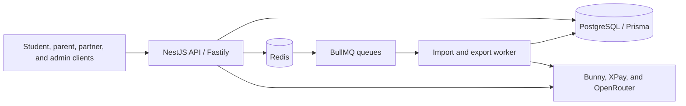

# Shaheen Edu API

The backend for an Egyptian secondary-education platform. It provides the
versioned REST API and background workers for academic content, student
learning, assessments, commerce, partner operations, and administration.

## At a glance

- **API:** NestJS 11 with Fastify, exposed under `/api/v1`
- **Data and jobs:** PostgreSQL with Prisma, plus Redis and BullMQ
- **Local stack:** Docker Compose starts PostgreSQL, Redis, the API, and the
  AI-question-import/report-export worker
- **Integrations:** Bunny Storage/Stream, XPay, and OpenRouter

## Capabilities

- Role-based identity and session management for super administrators,
  administrators, content/referral partners, students, and parents.
- Publishable academic hierarchy: grades, subjects, courses, chapters,
  lessons, sections, content, assets, and video metadata.
- Student catalog and delivery, entitlement checks, learning progress, study
  state, notebooks, assessments, written-answer grading, leaderboards, and
  performance views.
- Question banks with rich content blocks, review/publish workflows, and
  administrator-reviewed AI imports from text and PDF sources.
- Cart, pricing, coupons, manual-payment review, XPay checkout and webhooks,
  refunds, publisher agreements, referrals, partner allocations, settlements,
  analytics, and report exports.
- Operational support including structured/redacted logs, correlation IDs,
  health checks, integrity scans, and Redis queue recovery tools.

## Architecture



The HTTP application is built in [`src/app.factory.ts`](src/app.factory.ts).
Feature modules are registered in [`src/app.module.ts`](src/app.module.ts),
and [`src/worker.ts`](src/worker.ts) runs the queue consumers separately.

## Prerequisites

- Node.js 22 through 24
- pnpm 10 (enable Corepack if needed: `corepack enable`)
- Docker Engine with Docker Compose v2

## Run locally

```bash
pnpm install
pnpm dev:start
```

On the first run, `dev:start` creates `.env` from `.env.example`, builds the
images, starts the Compose stack, applies Prisma migrations, and seeds the
development database. Subsequent starts reuse the existing stack and data.

The API and worker run in containers; the host ports are:

| Service          | Address                                                               |
| ---------------- | --------------------------------------------------------------------- |
| API health       | <http://localhost:3000/health>                                        |
| API readiness    | <http://localhost:3000/health/ready>                                  |
| Swagger UI       | <http://localhost:3000/api/docs>                                      |
| API base path    | <http://localhost:3000/api/v1>                                        |
| Worker readiness | `http://ai-question-import-worker:3001/health/ready` (inside Compose) |
| PostgreSQL       | `localhost:5433`                                                      |
| Redis            | `localhost:6380`                                                      |

Swagger is enabled outside production by default. Set `API_DOCS_ENABLED=true`
to enable it explicitly, or `false` to disable it.

### Environment configuration

Start with [`.env.example`](.env.example). It contains development-only values
and documents every setting. Before running provider-backed
features, replace the placeholders for the relevant integration:

| Feature                                                       | Required configuration                                |
| ------------------------------------------------------------- | ----------------------------------------------------- |
| Asset upload and protected downloads                          | `BUNNY_STORAGE_*`                                     |
| Video upload and playback                                     | `BUNNY_STREAM_*`                                      |
| XPay checkout and webhooks                                    | `XPAY_*`                                              |
| AI import, explanations, planning, grading, and transcription | `OPENROUTER_API_KEY` and the relevant `AI_*` settings |

Never use the development secrets or sample super-admin credentials outside a
local environment. Production also requires secure cookies, real secret
values, an explicit CORS allow-list, and a correctly configured
`TRUST_PROXY_HOPS` value.

### Local lifecycle

```bash
pnpm dev:stop       # stop containers; keep local database and Redis data
pnpm dev:update     # rebuild API/worker and apply migrations
pnpm dev:seed       # reseed the development data
pnpm dev:clear      # remove containers, network, PostgreSQL, and Redis data
```

`dev:clear` is destructive to this project's Docker volumes. It does not
remove source files or `.env`.

## Development and verification

```bash
pnpm build          # production TypeScript build
pnpm test           # unit and focused integration tests
pnpm test:e2e       # PostgreSQL/Redis Testcontainers suite
pnpm test:all       # unit tests, e2e tests, then build
pnpm api:contract:check
pnpm journey:list   # list scripted user journeys
pnpm journey:current
```

The e2e suite requires a running Docker daemon. Full API-acceptance scripts
also use non-production provider credentials and can create remote test
resources; read [the testing guide](docs/testing/README.md) first.

## API and operational notes

- Authenticated routes are deny-by-default. The API uses bearer access tokens
  and a `refresh_token` cookie; Swagger documents both schemes.
- Refresh sessions use opaque, hashed tokens with rotation-family reuse
  detection. National IDs are protected with an HMAC lookup hash and
  AES-256-GCM encryption.
- Content access is determined from publication state, academic grade, the
  placement hierarchy, and time-bounded entitlements.
- Import and export jobs use durable queues with retries and backoff. The
  worker exposes its own readiness endpoint and exits when queue readiness is
  lost so a supervisor can restart it.
- XPay checkout uses idempotency keys; webhooks use timestamped HMAC signature
  verification.

## Documentation

- [Compact API reference](docs/api-reference-compact.md) and
  [detailed API reference](docs/api-reference-detailed.md)
- [Student catalog guide](docs/student-content-catalog-api-guide.md),
  [assessment API reference](docs/assessments-api-reference.md), and
  [video API reference](docs/video-api-reference.md)
- [Current user journeys](docs/testing/current-user-journeys.md) and
  [testing guidance](docs/testing/README.md)
- [AI usage and prompt inventory](docs/AI_USAGE_AND_PROMPTS_REPORT.md)
- [XPay integration guide](docs/xpay-integration-guide.md)
- [Production deployment guide](docs/production-deployment.md) and
  [observability and backup plan](docs/production-observability-and-backup-plan.md)

## License and handling

This is a private, unlicensed repository. Reuse or redistribution requires an
explicit ownership and licensing decision. Do not commit `.env` files,
provider credentials, or production data. Review the provenance and any
personal-data exposure in the tracked example assets before sharing them.
