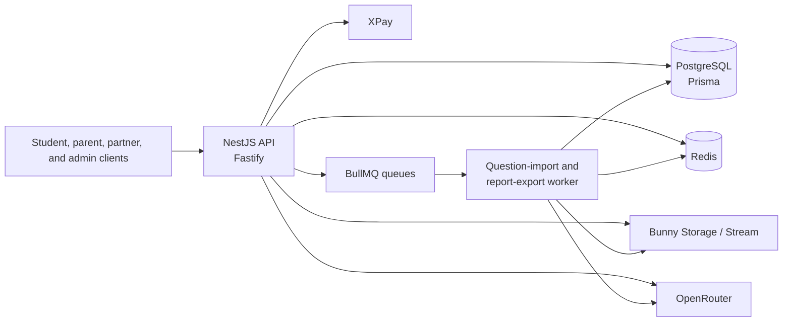

# Shaheen Edu API

Backend for an Egyptian secondary-education platform. It provides the API and
background workers behind curriculum management, student learning, assessment,
commerce, partner operations, and administrative workflows.

This is an active codebase rather than an auth-only starter. The original
README described only the first implementation phase; the sections below are
grounded in the modules currently wired into `src/app.module.ts`.

## What it implements

- Identity for super administrators, administrators, content/referral
  partners, students, and parent sessions; role-based authorization, refresh
  token rotation, auditing, and Redis-backed request throttling.
- A publishable academic hierarchy (grades, subjects, courses, chapters,
  lessons, sections, and content), student catalog/delivery, entitlement
  checks, assets, and video metadata.
- Learning progress, study state, notebooks, question attempts, assessments,
  written-answer grading, leaderboards, and student performance views.
- Question banks with rich content blocks, source/provenance fields, review
  states, bulk publishing, and an administrator-reviewed AI question-import
  workflow for text and PDF sources.
- Cart, pricing, coupons, manual-payment review, XPay checkout/webhooks,
  refunds, publisher agreements, referrals, partner allocations, settlements,
  analytics, and report exports.
- Operational building blocks: structured/redacted logging, correlation IDs,
  health/readiness checks, integrity scans, Redis queue recovery tooling, and
  Docker deployment/backup runbooks.

## Architecture



The API is created in [`src/app.factory.ts`](src/app.factory.ts), with its
feature modules registered in [`src/app.module.ts`](src/app.module.ts).
[`src/worker.ts`](src/worker.ts) runs the queue consumers and exposes a
separate worker readiness endpoint. PostgreSQL persists the domain model,
while Redis is used for throttling and BullMQ queues.

## Notable implementation choices

- Refresh sessions use opaque, hashed tokens with rotation-family reuse
  detection, so logout and password changes can revoke server-side sessions.
  See [`src/modules/auth`](src/modules/auth).
- Egyptian national IDs have a deterministic HMAC lookup hash and AES-256-GCM
  encrypted value; the privacy policy deliberately excludes the raw/encrypted
  ID from support views. See
  [`national-id.service.ts`](src/modules/auth/services/national-id.service.ts)
  and [`privacy-policy.ts`](src/common/privacy/privacy-policy.ts).
- Content access is resolved from the placement hierarchy, publication state,
  academic grade, and time-bounded course/chapter entitlements. Archived
  content requires an explicit access snapshot. See
  [`content-access-policy.service.ts`](src/modules/entitlements/content-access-policy.service.ts).
- Question imports and report exports are durable jobs with retries and
  backoff; the worker monitors queue readiness and exits on lost readiness so
  its supervisor can restart it. See
  [`question-import.queue.ts`](src/modules/ai-question-import/question-import.queue.ts)
  and [`worker.ts`](src/worker.ts).
- The XPay integration uses idempotency keys for checkout creation and checks
  timestamped HMAC webhook signatures with a constant-time comparison. See
  [`xpay.service.ts`](src/modules/commerce/xpay.service.ts).

## Stack

TypeScript, NestJS 11, Fastify, Prisma, PostgreSQL, Redis, BullMQ, Jest,
Docker Compose, Pino, Joi, and Swagger/OpenAPI. Optional integrations include
Bunny Storage/Stream, XPay, and OpenRouter.

## Run locally

Prerequisites: Node.js 22–24, pnpm 10, Docker, and Docker Compose.

```bash
pnpm install
pnpm dev:start
```

`dev:start` copies `.env.example` to `.env` if needed, builds the local Docker
stack, applies Prisma migrations, seeds it, and starts PostgreSQL, Redis, the
API, and the AI-import worker. Update the generated environment values before
sharing or deploying the environment.

- Health: `GET http://localhost:3000/health`
- Readiness: `GET http://localhost:3000/health/ready`
- Swagger UI (outside production unless explicitly enabled):
  `http://localhost:3000/api/docs`

Useful lifecycle commands:

```bash
pnpm dev:stop       # stop services and retain local data
pnpm dev:update     # rebuild API/worker and apply migrations
pnpm dev:clear      # removes this project's local Compose data
```

`dev:clear` is destructive to the local PostgreSQL and Redis volumes. It does
not change source files or `.env`.

## Verify

```bash
pnpm test           # unit and focused integration specs
pnpm test:e2e       # disposable PostgreSQL/Redis Testcontainers suite
pnpm build          # TypeScript production build
pnpm test:all       # unit tests, e2e tests, then build
```

The e2e suite needs a running Docker daemon. Full API-acceptance scripts also
need dedicated non-production provider credentials and can create remote test
resources; read [`docs/testing/README.md`](docs/testing/README.md) before
running them.

## Documentation map

- [Compact API reference](docs/api-reference-compact.md) and
  [detailed API reference](docs/api-reference-detailed.md)
- [Current user journeys](docs/testing/current-user-journeys.md) and
  [testing guidance](docs/testing/README.md)
- [AI usage and prompt inventory](docs/AI_USAGE_AND_PROMPTS_REPORT.md)
- [XPay integration guide](docs/xpay-integration-guide.md)
- [Production deployment guide](docs/production-deployment.md) and
  [observability/backup plan](docs/production-observability-and-backup-plan.md)

The deployment material documents an intended operating model; it is not, by
itself, evidence that a particular deployment is live or that the documented
controls have been exercised.

## Scope and limitations

- AI-generated question candidates, explanations, quiz plans, and grading
  outputs are application features with review/provenance handling; they are
  not presented as authoritative educational answers by default.
- National-ID validation is structural (format, date, and century marker); it
  does not validate a final checksum digit.
- The repository has test coverage and deployment automation, but no checked-in
  CI workflow was found during this review. Run the verification commands in
  the target environment rather than assuming a green build.
- `package.json` is `private` and `UNLICENSED`; reuse or redistribution needs
  an explicit ownership/licensing decision.

## Contribution and publication notes

Git history contains 165 commits, all attributed to Mahmoud Khedr, from the
initial auth implementation through curriculum, commerce, AI, and operations
work. The public GitHub repository is not marked as a fork. This is useful
provenance evidence, but it does not establish rights to every non-code asset.

The tracked `test-files/` and `example-questions/` directories include PDFs,
images, audio, and screencasts. Review their source, personal-data exposure,
and redistribution rights before featuring this repository publicly or sharing
an archive. Example environment files are intentionally tracked; never commit
real environment files or provider credentials.
