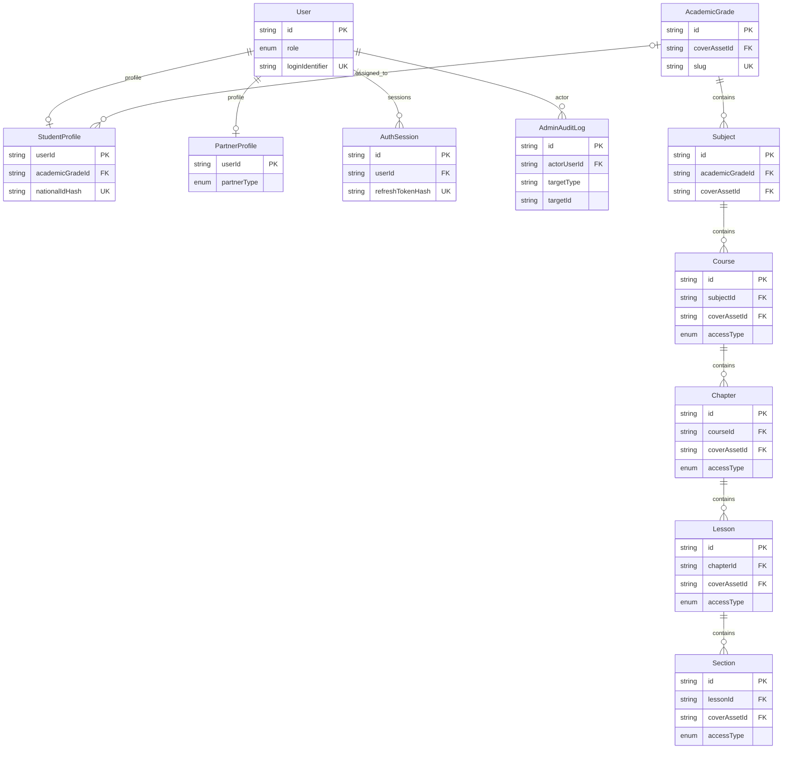
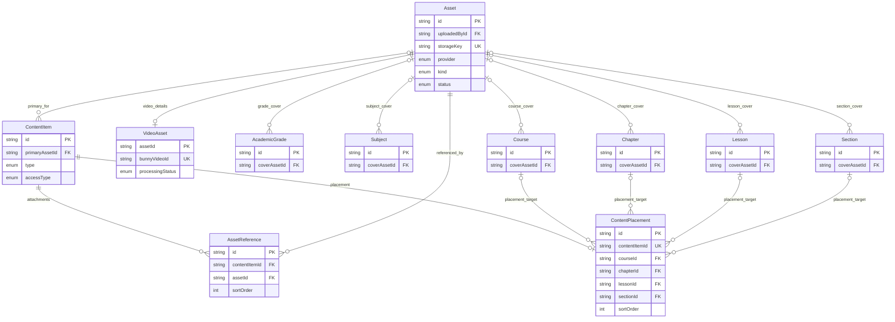
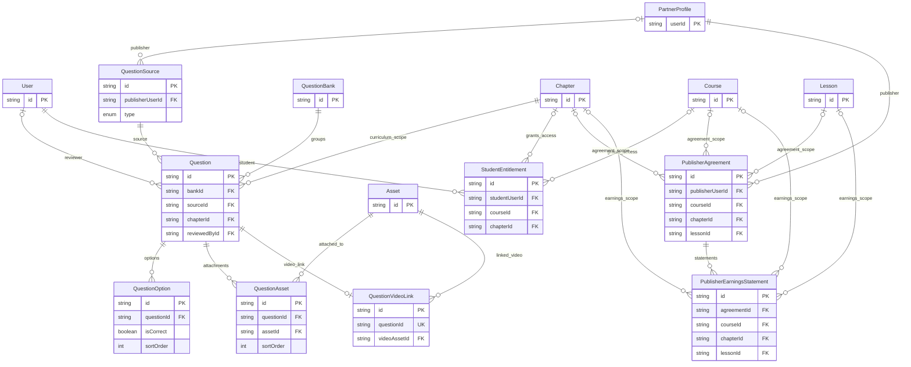

# Database schema reference

This document describes the PostgreSQL schema declared in
[`prisma/schema.prisma`](../prisma/schema.prisma). Prisma uses `cuid()` string
primary keys throughout. Most models have `createdAt`; mutable models generally
use `updatedAt` with Prisma's `@updatedAt`.

## Relationship maps

The diagrams use crow's-foot notation: `||` means exactly one, `o|` zero or
one, and `o{` zero or many. Field names marked `FK` are actual Prisma
relations. Scalar IDs such as `createdById` are included only where they are
real relations; several audit/administration IDs are deliberately unlinked
scalars and are covered later in this document.

### Accounts and curriculum



### Content and assets



### Questions, access, and publisher revenue



For readability, the diagrams do not repeat the common `createdById` and
`updatedById` relations. `AcademicGrade`, `Subject`, `Course`, `Chapter`,
`Lesson`, `Section`, `ContentItem`, `QuestionSource`, `QuestionBank`, and
`Question` each require both fields to reference `User`; question rows may
also have one `reviewedById` user. `Asset.uploadedById` also references `User`.
All of these actual relations use `onDelete: Restrict`.

## Identity, authentication, and profiles

### `User`

The central account table. `loginIdentifier` and `passwordHash` support
authentication; `role` is one of `SUPER_ADMIN`, `ADMIN`, `PARTNER`, or
`STUDENT`, and `status` controls account availability (`ACTIVE`, `SUSPENDED`,
or `DISABLED`).

Relations:

- Has at most one `StudentProfile` and at most one `PartnerProfile`.
- Has many `AuthSession` records and `AdminAuditLog` records (as actor).
- Is the creator/updater of curriculum, content, question-source, question-bank,
  and question records; may also be a question reviewer and asset uploader.
- Has many `StudentEntitlement` records as the entitled student.

### `StudentProfile`

Optional one-to-one extension of `User` (`userId` is both primary key and FK).
It stores identity and contact data plus an optional `AcademicGrade`.
`nationalIdHash` is unique; the encrypted identifier and its last four digits
are stored separately for protected lookup/display use cases.

- `userId → User.id`: **cascade delete**.
- `academicGradeId → AcademicGrade.id`: optional; **restrict delete**.

### `PartnerProfile`

Optional one-to-one `User` extension for content publishers and referral
partners. It is referenced by publisher agreements and, optionally, by
question sources.

- `userId → User.id`: **cascade delete**.
- `createdByAdminId` is an ID value but is not declared as a Prisma relation.

### Sessions and audit

- `AuthSession` belongs to one `User`; deleting that user cascades to sessions.
  `refreshTokenHash` is unique and `familyId` groups token-rotation families.
- `ParentAccessSession` is an independent session table keyed by normalized
  parent phone number. `activeStudentId` is deliberately not a foreign key.
- `AdminAuditLog` belongs to its actor `User`. It records an action, generic
  target type/ID, optional JSON metadata, and correlation ID. Its target is
  polymorphic and therefore not a database relation.

## Curriculum and content hierarchy

The canonical learning hierarchy is:

```text
AcademicGrade → Subject → Course → Chapter → Lesson → Section
```

Each level has title, slug, optional description, `sortOrder`, publication
timestamps, `ContentStatus` (`DRAFT`, `PUBLISHED`, `ARCHIVED`), creator and
updater. The parent relationship uses **restrict delete**, preserving the
hierarchy. Sibling slugs and sort orders are unique within their parent:

| Model | Parent FK | Unique within parent |
| --- | --- | --- |
| `Subject` | `academicGradeId` | `slug`, `sortOrder` |
| `Course` | `subjectId` | `slug`, `sortOrder` |
| `Chapter` | `courseId` | `slug`, `sortOrder` |
| `Lesson` | `chapterId` | `slug`, `sortOrder` |
| `Section` | `lessonId` | `slug`, `sortOrder` |

`AcademicGrade.slug` and `AcademicGrade.sortOrder` are globally unique.
Students may optionally be assigned an academic grade through
`StudentProfile`.

`Course`, `Chapter`, and `Lesson` additionally have optional price/currency
fields and `isPurchasable`. Their `accessType` controls access at that level;
lower levels default to `INHERIT`. `Section` also has an inheritable access
type. `AccessType` is `PUBLIC`, `FREE`, `PAID`, or `INHERIT`.

Every hierarchy level can have one optional cover `Asset`; one asset can be
used as the cover of many records. Cover references use **restrict delete**.

### `ContentItem` and `ContentPlacement`

`ContentItem` is reusable learning material. Its `type` identifies text,
external link, video, PDF, image, document, or downloadable file. Depending
on type, it can hold `textBody`, `externalUrl`, a `primaryAsset`, and/or
attachment references.

`ContentPlacement` is the one-to-one placement record for a content item:

- `contentItemId` is unique, so an item can be placed once at most.
- It can point to a `Course`, `Chapter`, `Lesson`, or `Section`, each optional
  and **restrict delete**.
- The intended invariant is that **exactly one** of those four target IDs is
  set. This is not enforced by the Prisma schema, so it must be validated by
  application logic or a database check constraint.
- `sortOrder` is indexed with each possible parent, but not declared unique;
  ordering collisions are technically possible.

Deleting a `ContentItem` cascades to its placement.

## Assets and video processing

### `Asset`

Stores file metadata and lifecycle for Bunny Storage or Bunny Stream. `kind`
describes the intended use, and `status` tracks upload/readiness/archive state.
`storageKey` is unique when present. Every asset has one uploader (`User`),
which cannot be deleted while referenced (**restrict delete**).

Assets are reused as:

- primary assets for content items;
- ordered `AssetReference` attachments on content items;
- optional cover images on the curriculum hierarchy;
- one-to-one `VideoAsset` extensions; and
- question attachments or linked videos.

### `AssetReference` and `VideoAsset`

`AssetReference` implements the many-to-many relationship between content
items and assets, with a type and display order. It prevents both duplicate
asset links and duplicate sort order per content item. Deleting a content item
cascades to its references; deleting an asset is restricted.

`VideoAsset` is an optional one-to-one extension of `Asset` (`assetId` is its
primary key). It contains Bunny Stream identifiers, processing state/progress,
duration, thumbnail, webhook timing, and failure data. Deleting its asset
cascades to this extension. `bunnyVideoId` is unique.

`BunnyStreamWebhookEvent` is an independent idempotency/audit record for
incoming webhook payloads; `eventKey` is unique. `bunnyVideoId` is stored as a
value rather than an FK to `VideoAsset`.

## Questions

### Sources, banks, and questions

- `QuestionSource` describes provenance (platform, publisher, external book,
  previous exam, or ministry model). It optionally belongs to a publisher
  `PartnerProfile` and has its own publication lifecycle.
- `QuestionBank` groups questions and has a content publication lifecycle.
- `Question` belongs to exactly one bank, source, and `Chapter`; all three
  references use **restrict delete**. It records a single-choice question body,
  explanation, review status/notes, creator/updater, and optional reviewer.

All question authoring and review user references use **restrict delete**.
Question-source publisher references also use **restrict delete**.

### Options and media

- `QuestionOption` belongs to one question and is deleted with it. Its order is
  unique within that question. The schema does not enforce exactly one correct
  option; that is an application invariant for `SINGLE_CHOICE` questions.
- `QuestionAsset` is an ordered question-to-asset join table. It prevents
  duplicate asset links and duplicate ordering per question; deleting the
  question cascades, while asset deletion is restricted.
- `QuestionVideoLink` is an optional one-to-one link from a question to an
  asset used as video. `questionId` is unique; it is cascaded on question
  deletion and restricts deletion of the video asset.

## Access, publishing, and revenue

### `StudentEntitlement`

Represents a student’s time-bounded entitlement to one optional `Course` or
`Chapter`, including its source (`ADMIN`, `PROMOTION`, `MIGRATION`, `PAYMENT`),
active/revoked status, and dates. Student, course, and chapter references use
**restrict delete**.

The intended invariant is likely that exactly one of `courseId` or `chapterId`
is set. The schema permits zero or both, so this needs application validation.
`grantedById` and `revokedById` are scalar user-ID values, not declared FKs.

### `PublisherAgreement`

Defines a publisher’s revenue share in basis points over a date range. It
belongs to a `PartnerProfile` and may target a course, chapter, or lesson.
All target references use **restrict delete**.

The intended invariant is exactly one target scope (`courseId`, `chapterId`, or
`lessonId`); the current schema does not enforce it. `createdById` is likewise
an unlinked scalar ID.

### `PublisherEarningsStatement`

Records calculated publisher earnings for a period. It belongs to one
`PublisherAgreement` and can repeat the course/chapter/lesson scope. These
references use **restrict delete**. `createdById` is a scalar, not a relation.

As with agreements, application logic should ensure a coherent single scope
and that it matches the agreement.

## Referential-action summary

| Action | Used for |
| --- | --- |
| `Cascade` | A user’s profile/session; a content item’s placement/asset references; an asset’s video extension; a question’s options/media. |
| `Restrict` | Curriculum parents, users that authored or uploaded data, reusable assets, question sources/banks/chapters, and all commercial targets. |
| Default (`NoAction`) | `AdminAuditLog.actor` has no explicit `onDelete`; PostgreSQL/Prisma default behavior applies. |

## Enum reference

| Enum | Purpose |
| --- | --- |
| `Role`, `AccountStatus` | User authorization and availability. |
| `PartnerType` | Content publisher or referral partner. |
| `ContentStatus`, `ContentItemType`, `AccessType` | Publishing state, material type, and access rules. |
| `EntitlementSource`, `EntitlementStatus` | Student access provenance and lifecycle. |
| `PublisherAgreementStatus` | Publisher contract lifecycle. |
| `AssetProvider`, `AssetKind`, `AssetStatus`, `AssetReferenceType`, `VideoProcessingStatus` | Storage/video asset modelling and processing. |
| `QuestionSourceType`, `QuestionStatus`, `QuestionType` | Question provenance, workflow, and format. |
